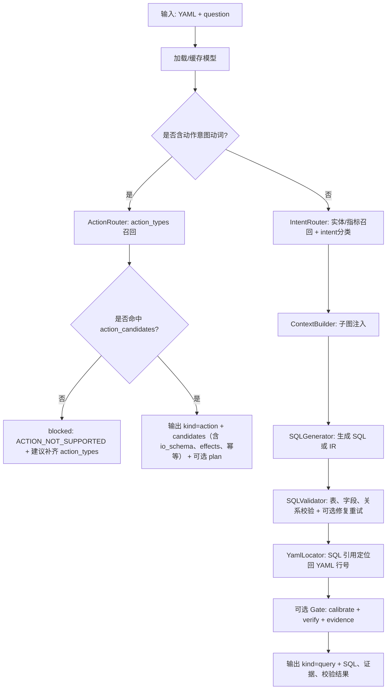

# 本体咨询器（ontology-rag-query-skill-cskill）

一个可复用的 Query Skill：输入 **OSI/本体 YAML** + **自然语言指令**，输出**结构化结果 JSON**，用于让任意 Agent 在“拿到本体”后即可产出可审计、可消费的结构化回复。

支持两类输出：
- **Query**：不直接输出 SQL（默认），而是输出：intent + 命中数据集（referenced_tables）+ 需要用到的属性（data_requirements）+ 校验错误/建议 + YAML 定位（yaml_trace）+（可选）gate 证据  
  （如需调试可通过 `--emit-sql` 打开 SQL 输出）
- **Action/Command**：动作候选（action_types）+ 参数 schema（io_schema）+ 幂等/标签/规则提示 +（可选）plan（Query-1..Action-2 风格）

## 1. 目标与边界

### 1.1 目标
- **让任何 Agent** 在接收到本体 YAML 后，能够把用户问题转成**结构化结果**（而不是散文式回答）。
- 输出要支持：
  - **Query**：SQL 草案 + 意图 + 命中实体 + 校验错误/建议 + YAML 定位（可审计）
  - **Action/Command**：动作候选（action_types）+ 参数 schema（io_schema）+ 风险/幂等信息 + 规则提示（rules）

### 1.2 边界（重要）
- 本体咨询器 **不负责真实执行**数据库查询、写操作、发券、建套餐等（那是 Data Agent/业务服务的职责）。
- 本体咨询器只输出：
  - **“能查什么/怎么查”**（SQL 结构化输出）
  - **“能做什么/怎么做”**（动作候选 + io_schema + plan 骨架）
  - **“为什么不行”**（blocked + violations + suggestion）

## 2. 输入与输出（契约）

### 2.1 输入
必须提供：
- `yaml_path`：本体 YAML 文件路径（推荐），或 `yaml_text`：本体 YAML 字符串（二选一）
- `question`：自然语言指令

可选参数：
- `dialect`：SQL 方言（默认 `ANSI_SQL`）
- `generation_mode`：`llm_sql` / `ir_sqlglot`（默认 `llm_sql`）
- `provider`：`mock` / `openai` / `anthropic|minimax`

### 2.2 输出（稳定 JSON 结构）
顶层字段（稳定）：
- `status`: `ok` / `blocked` / `error`
- `kind`: `query` / `action`
- `input`: 输入摘要（question、dialect、generation_mode、model_name）
- `output`: query 相关输出（sql(默认空)/is_valid/intent/confidence/referenced_*/data_requirements/validation_*/yaml_trace/metrics）
- `action`: action 相关输出（action_intent/action_confidence/action_candidates/rule_hints）
- `plan`（可选）：当识别为动作意图且命中候选动作时，输出 **Query-1..Action-2 风格**计划骨架（含 depends_on 与 `$StepRef` 引用）
- `violations`（可选）：当 blocked 时，列出原因与建议
- `gate`（可选）：更强的闸门结构化证据（patches/violations/evidence）
- `summary`: 一句话摘要（便于 UI 展示）

## 3. 执行流程（从指令到结构化输出）

### 3.1 总览流程


### 3.2 步骤解释（对应代码/模块）
1) **模型加载与缓存**：读取 YAML 构建 KG；对同一份 YAML（sha256）+ dialect + mode 做缓存  
2) **动作意图判定**：包含“创建/新增/赠送/发券/升级/修改…”等动词 → 优先走 action 分支  
3) **ActionRouter（动作召回）**：基于 `id/title/synonyms/examples/tags` 匹配 action_types，输出 candidates + rule_hints；并 enrich `io_schema/effects/...`  
4) **Query（当不含动作意图）**：IntentRouter → ContextBuilder → SQL/IR 生成 → SQLValidator 校验/修复  
5) **YAML 定位**：生成 SQL 时输出 yaml_trace（定位到 dataset/field 行号）  
6) **Gate（可选）**：输出更强的 patches/violations/evidence 证据结构  

## 4. 前置条件

本 Skill 复用 `ontology-rag` 的能力，因此需要先安装 `ontology-rag`（可用 pip editable 或直接 pip 安装你们的包）：

```bash
pip install -e "/path/to/ontology-rag" --break-system-packages
```

可选（按需）：
```bash
pip install -e "/path/to/ontology-rag[openai,anthropic,sqlglot]" --break-system-packages
```

## 5. 运行示例

### 5.1 mock（无需 Key）
```bash
python3 scripts/query_skill.py \
  --yaml "/path/to/model.yaml" \
  --question "本月采购订单数量是多少？" \
  --provider mock
```

### 5.2 OpenAI
```bash
export OPENAI_API_KEY=...
python3 scripts/query_skill.py \
  --yaml "/path/to/model.yaml" \
  --question "从请购到采购订单平均要多少天？" \
  --provider openai \
  --model gpt-4o-mini
```

### 5.3 MiniMax Anthropic 兼容
```bash
export ANTHROPIC_BASE_URL=https://api.minimaxi.com/anthropic
export ANTHROPIC_API_KEY=...
python3 scripts/query_skill.py \
  --yaml "/path/to/model.yaml" \
  --question "三单匹配异常主要集中在哪些供应商？" \
  --provider minimax
```

## 6. 示例输出

- 复合指令（包含 Query-1..Action-2 plan）：  
  `examples/food_v2_plan_style_result.json`
- 复合指令（候选动作/结构化输出）：  
  `examples/food_v2_full_request_result.json`

## 7. Agent Skill 使用方案（导入后引导提示）

把本体咨询器安装/导入为 Skill 后，推荐在你的 Agent（Application/Ontology/Data 任意层）的提示词或交互引导中加入一个**固定入口模板**，让用户或上层 Agent 用一致格式触发本体查询：

### 7.1 推荐引导模板（复制即用）

**本体模型查询：** `{本体模型文件}`  
**Query：** `{自然语言查询内容}`

示例：
- 本体模型查询：`/path/to/food_semantic_model_semantic_v2.yaml`  
  Query：`查询去年会员积分最多的前10个用户，并提示每个用户的会员等级`

### 7.2 对复合指令的推荐写法
当用户同时包含“查询 + 动作/发券/新增套餐”等复合诉求时，建议继续用同一入口，但在 Query 内把动作诉求写完整：

**本体模型查询：** `/path/to/food_semantic_model_semantic_v2.yaml`  
**Query：** `查询去年积分Top10会员并发放免费菜券；找出临期最严重原材料并推荐可消耗菜品；创建会员套餐并绑定券权益，最低消费=赠送菜品基本成本。`

本体咨询器将输出：
- `kind=action`（包含 action_candidates + 可选 plan）
- 若是纯查询，则输出 `kind=query`（包含 SQL + yaml_trace + 可选 gate）

### 7.3 建议的 Agent 侧交互策略（可选）
- 若用户未提供“本体模型文件”：提示用户先选择/提供本体 YAML（否则可能 NO_GROUNDING）
- 若输出 `status=blocked` 且 `code=ACTION_NOT_SUPPORTED`：提示“当前本体缺动作目录 action_types”，引导补齐 examples/synonyms/io_schema
- 若输出 `kind=query` 且 `is_valid=false`：把 `validation_errors[].suggestion` 作为用户下一步补充条件/修模型的提示
